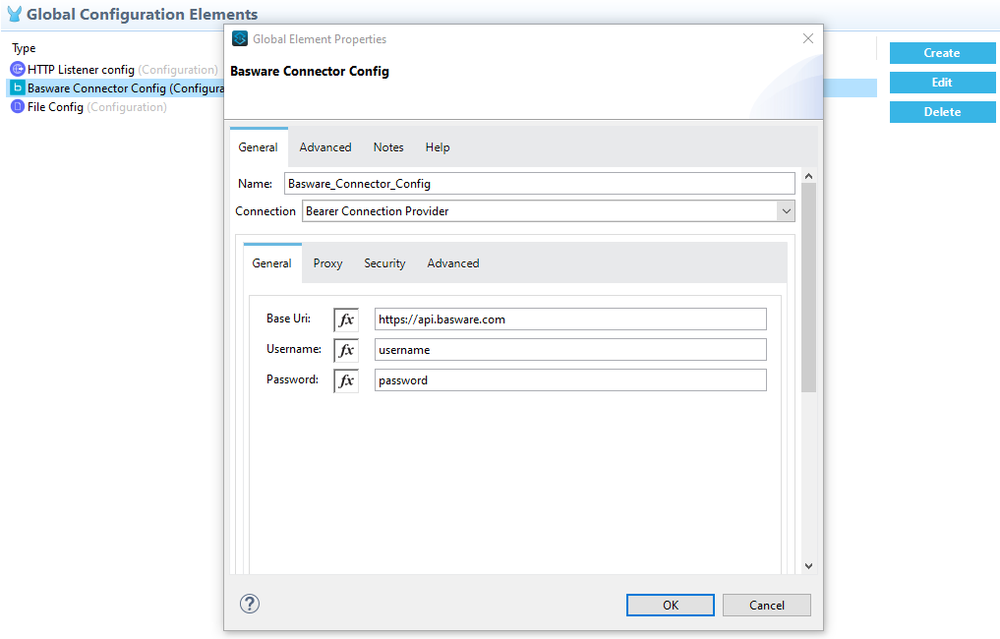
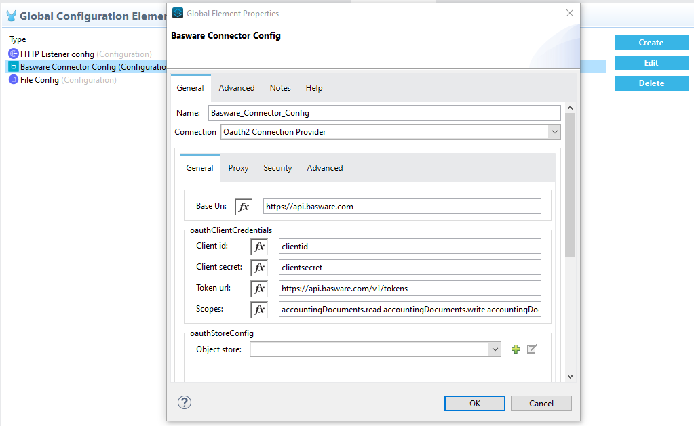
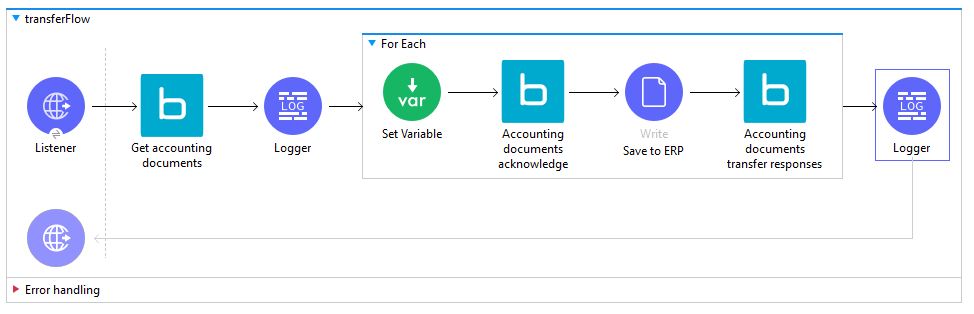
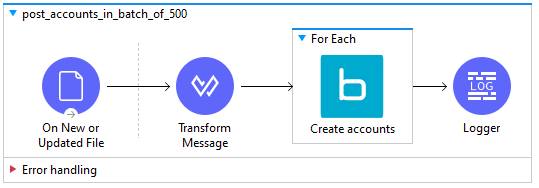
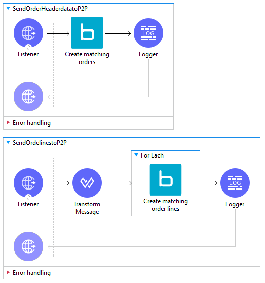
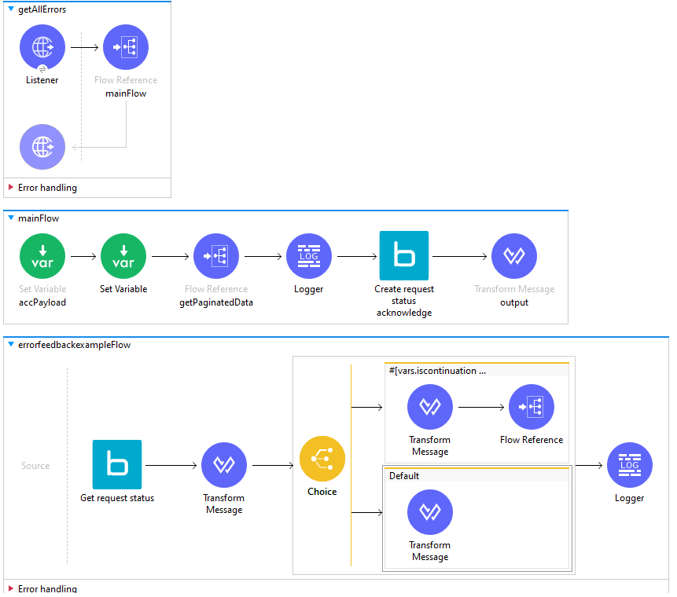

== Basware connector usage examples
This page provides Mulesoft flows for common Basware API integration scenarios. High level notes and Links to relevant sections of Basware API documentation have been included with the scenarios. To make the examples usable out of the box with Basware API JSON files, the flows assume the data coming in is already mapped to Basware Formats. The data mapping step needs to be added in front of each example. These are fragments illustrating specific cases and not complete integration flows.

== Determining URL endpoint bassed on API region
Basware Master data and P2P APIs are available through the following regions: Europe (EU), USA (US), Australia (AU) and Canada (CA). The APIs will be set up in the same region as your P2P system. Separate environments are available for test and production systems. The URL endpoint for accessing Basware API varies depending on region and whether test or production environment is used. Please use the https://developer.basware.com/api/p2p/api_reference[Purchase-to-Pay API reference] page to determine your URL for sending requests to Basware API.

== Authenticating to Basware APIs

Basware API supports both oAUTH2 client credentials flow and basic authentication. Below screenshots show configuration examples for setting up either authentication method. For details on authenticating to Basware API, see section https://developer.basware.com/api/p2p/manual#Authentication[authentication and access rights] on Basware API developer site. 

__Above: Basic authentication example. Remember to set the Base URL according to region and environment type (test / prod) used.__

__Above: oAUTH2 authentication example. Remember to set the 'Base Uri' and 'token url' according to region and environment type (test / prod) used. https://developer.basware.com/api/p2p/manual#Authentication[Available operation scopes] are listed on the Basware API developer site.__

== Transferring invoices to ERP system
Receiving accounting documents (invoices ready to be transferred to accouting) is done in the following steps:

. GET accountingDocuments - Get the invoice data payload
. POST accountingDocuments/{invoiceId}/acknowledge - Acknowledge that payload was received
. Save the invoice to ERP system
. POST accountingDocuments/{invoiceId}/transferResponse - Inform Basware API that ERP system accepted / rejected the invoice 

For more details, see section https://developer.basware.com/api/p2p/manual#usage3[Usage Scenario 3: Prebook and transfer invoices to accounting] on Basware API developer.

__Above: Example flow for receiving invoices from Basware API and sending back transfer succeeded / failed response messages.__

The above flow receives invoices which are 'ReadyForTransfer' and acknowledges the back to Basware API that the data is received for processing. Acknowledging the transfer will change the invoice status in Basware API so they are not offered again on the next GET operation. When the ERP system has succesfully received the invoice, another response is sent to Basware API to indicate in Basware P2P that invoice was succesfully transferred. If the ERP system rejects the invoice transfer make sure to map the failure response back to Basware API along with the related error message. 

After the invoice has been paid, typically a https://api.basware.com/swagger/index.html#/AccountingDocuments[paymentResponse] message is sent to Basware API to update payment status. This is sent similiarly to the transferResponse. 

__Above flow can be imported using following Mulesoft code:__
[source,xml,linenums]
-----------------
<?xml version="1.0" encoding="UTF-8"?>

<mule xmlns:file="http://www.mulesoft.org/schema/mule/file" xmlns:basware-connector="http://www.mulesoft.org/schema/mule/basware-connector"
	xmlns:http="http://www.mulesoft.org/schema/mule/http" xmlns="http://www.mulesoft.org/schema/mule/core" xmlns:doc="http://www.mulesoft.org/schema/mule/documentation" xmlns:xsi="http://www.w3.org/2001/XMLSchema-instance" xsi:schemaLocation="http://www.mulesoft.org/schema/mule/core http://www.mulesoft.org/schema/mule/core/current/mule.xsd
http://www.mulesoft.org/schema/mule/http http://www.mulesoft.org/schema/mule/http/current/mule-http.xsd
http://www.mulesoft.org/schema/mule/basware-connector http://www.mulesoft.org/schema/mule/basware-connector/current/mule-basware-connector.xsd
http://www.mulesoft.org/schema/mule/file http://www.mulesoft.org/schema/mule/file/current/mule-file.xsd">
	<http:listener-config name="HTTP_Listener_config" doc:name="HTTP Listener config" doc:id="6ebb99e5-01f1-4846-8e90-eaea7d4c36d2" >
		<http:listener-connection host="0.0.0.0" port="8081" />
	</http:listener-config>
	<basware-connector:config name="Basware_Connector_Config" doc:name="Basware Connector Config" doc:id="d59f08b6-1ecc-4989-b518-9d631698523b" >
		<basware-connector:bearer-connection username="USERNAME" password="PASSWORD" baseUri="https://test.api.basware.com" />
	</basware-connector:config>
	<file:config name="File_Config" doc:name="File Config" doc:id="25ec8947-c1f0-40c6-89e2-e999999f63f8" >
		<file:connection/>
	</file:config>
	<flow name="transferFlow" doc:id="fa918042-1679-4524-abdc-208a4b47deb1" >
		<http:listener doc:name="Listener" doc:id="faba0e63-0a9b-4b49-8bb1-1b14095f6a57" config-ref="HTTP_Listener_config" path="laskut"/>
		<basware-connector:get-v1-accounting-documents doc:name="Get accounting documents" doc:id="193da65e-41aa-4366-8d5e-a08a45b44cbd" config-ref="Basware_Connector_Config" processingStatusQueryParam="WAITING_FOR_TRANSFER"/>
		<logger level="INFO" doc:name="Logger" doc:id="5129d9b1-6e31-4468-bbcb-f01c21fb8017" message="#[payload]"/>
		<foreach doc:name="For Each" doc:id="9108b269-3f60-418f-ac6b-e009aa0c63d9" collection="#[payload.*accountingDocuments]">
			<set-variable value="#[payload]" doc:name="Set Variable" doc:id="deb28d7c-5f97-4c9b-8a7e-58e69080d082" variableName="invoicedata"/>
			<basware-connector:post-v1-accounting-documents-invoice-id-acknowledge doc:name="Accounting documents acknowledge" doc:id="af997f69-62c2-444c-8ba7-a32c5ad55755" config-ref="Basware_Connector_Config" contentTypeHeader="application/json" invoiceIdUriParam="#[output application/java&#10;---&#10;payload.invoiceId[0]]"/>
			<file:write doc:name="Save to ERP" doc:id="702f0a18-3f2a-4f88-94b9-8241c97b0bf3" config-ref="File_Config" path="#['C:/temp/anypointinput/output/' ++ vars.invoicedata.invoiceId[0] ++ '.json']" >
				<file:content ><![CDATA[#[vars.invoicedata]]]></file:content>
			</file:write>
			<basware-connector:post-v1-accounting-documents-invoice-id-transfer-responses doc:name="Accounting documents transfer responses" doc:id="510f0b20-8e1e-42f4-a2d5-016a1779f224" config-ref="Basware_Connector_Config" contentTypeHeader="application/json" invoiceIdUriParam="#[vars.invoicedata.invoiceId[0]]" >
				<basware-connector:post-v1-accounting-documents-invoice-id-transfer-responses-body ><![CDATA[#[import * from dw::core::Dates
output application/json
---
{
	paymentBlock: false,
	externalCode: uuid(),
	success:  true,
	sourceSystem: vars.invoicedata[0].supplierSourceSystemId default 'ERP',
	voucherNumber2: 12345,
	voucherNumber1: 12345,
	responseMessage: 'succesfully transferred',
	transferDate: today()
}]]]></basware-connector:post-v1-accounting-documents-invoice-id-transfer-responses-body>
			</basware-connector:post-v1-accounting-documents-invoice-id-transfer-responses>
		</foreach>
		<logger level="INFO" doc:name="Logger" doc:id="39a59b7f-ef6c-4841-95bf-6a6c3a95b06f" />
	</flow>
</mule>
-----------------

== Importing basic data
Importing data through Basware API is done by POSTing batches of 100-500 records at time, depending on the API used. The appropriate https://developer.basware.com/api/p2p/manual#listofAPIs[API(s) to use for import can be found here]. 

For more details, see section https://developer.basware.com/api/p2p/manual?hsLang=en#usage1[Usage Scenario 1: Import master data] on Basware API developer site. 

__Above: Example flow transforming a message to data format used by Basware API and sending the records in multiple POST operations.__

Basware API imports data in two steps: First there is a schema validation on the API layer, second the data is sent to and processed in the target system(s) such as Basware P2P. Processing confirmation statuses and any potential errors are returned separately from both steps. In the first step the status is indicated by the HTTP response to the request, i.e. "200 OK". The status from second step is available through 'requestStatus' API. Please make sure you are https://developer.basware.com/api/p2p/manual#usage5[verifying the statuses from both processing steps]. 

__Above flow can be imported using following Mulesoft code:__
[source,xml,linenums]
-----------------
<flow name="baswareconnectorFlow9" doc:id="5b8f76eb-e84a-4150-a090-5f1044e595f8" >
		<file:listener doc:name="On New or Updated File" doc:id="d1147d38-72de-48ef-a35f-e6ee80f2b16a" config-ref="File_Config" directory="C:\temp\anypointinput\input5" moveToDirectory="C:\temp\anypointinput\input5\bu" recursive="false" autoDelete="true">
			<scheduling-strategy >
				<fixed-frequency />
			</scheduling-strategy>
		</file:listener>
		<ee:transform doc:name="Transform Message" doc:id="5bb2fa1a-09b3-4f54-bd80-47ebd73a0516" >
			<ee:message >
				<ee:set-payload ><![CDATA[%dw 2.0
import * from dw::core::Arrays
output application/json
---
(payload.root.*listItem map {
    lastUpdated : $.lastUpdated,
    accountCode: $.accountCode,
    companies: [$.companies.listItem],
    externalCode: $.externalCode,
    accountNames: [$.accountNames.listItem]
}) divideBy  500]]></ee:set-payload>
			</ee:message>
		</ee:transform>
		<foreach doc:name="For Each" doc:id="b165ebce-c2df-4df4-94b9-7dd561344fb0" >
			<basware-connector:post-v1-accounts doc:name="Create accounts" doc:id="f2fae0eb-8c66-48e0-a4ca-a7b0a6be4897" config-ref="Basware_Connector_Config" contentTypeHeader="application/json">
		</basware-connector:post-v1-accounts>
		</foreach>
		<logger level="INFO" doc:name="Logger" doc:id="e35f5bca-7801-4464-831b-0330c7abcb3b" />
	</flow>
-----------------

== Importing orders for invoice to order matching
'Matching orders' used for automatic invoice to order matching are imported through matchingOrders and matchingOrderLines APIs. The lines are linked to the order using the 'orderExternalCode' field. Please first post the matchingOrder before you post the related matchingOrderLines for the first time. After the matchingOrder has been previously posted, it is enough to update just the matchingOrderLines on any subsequest updates, such as when adding goods receipt notes to existing matchingOrderLines. 

For more details, see section https://developer.basware.com/api/p2p/manual#usage2[Usage Scenario 2: Import external purchase orders for Matching] on Basware API developer site. 

__Above: Importing matching orders and matching order lines.__ 

Basware API imports data in two steps: First there is a schema validation on the API layer, second the data is sent to and processed in the target system(s) such as Basware P2P. Processing confirmation statuses and any potential errors are returned separately from both steps. In the first step the status is indicated by the HTTP response to the request, i.e. "200 OK". The status from second step is available through 'requestStatus' API. Please make sure you are verifying the statuses from both processing steps.

__Above flow can be imported using following Mulesoft code:__
[source,xml,linenums]
-----------------
<flow name="SendOrderHeaderdatatoP2P" doc:id="d2d168d7-73c0-48db-989e-c2c330919a64" >
		<http:listener doc:name="Listener" doc:id="8b66fc36-4634-4960-9aff-028e77d6c78d" config-ref="HTTP_Listener_config" path="matchingheader"/>
		<basware-connector:post-v1-matching-orders doc:name="Create matching orders" doc:id="688a609b-33ef-4a66-82a9-6bfaae76bbd9" config-ref="Basware_Connector_Config" contentTypeHeader="application/json"/>
		<logger level="INFO" doc:name="Logger" doc:id="e5586ecd-3171-49fc-a3d2-dbe261de450a" />
	</flow>
	<flow name="SendOrdelinestoP2P" doc:id="be53a586-097b-4126-adb4-c7f9bc48e5dd" >
		<http:listener doc:name="Listener" doc:id="5e50ca71-40d5-45c5-a210-9ad41e56601a" config-ref="HTTP_Listener_config" path="matchinglines"/>
		<ee:transform doc:name="Transform Message" doc:id="d0e00d24-1181-4fa6-b66c-3737d86b39d2" >
			<ee:message >
				<ee:set-payload ><![CDATA[%dw 2.0
import * from dw::core::Arrays
output application/json
---
(payload map ( payload01 , indexOfPayload01 ) -> {
	externalCode: payload01.externalCode,
	sortNumber: payload01.sortNumber as Number,
	netPrice: payload01.netPrice as Number,
	taxSum2: payload01.taxSum2 as Number,
	grossPrice: payload01.grossPrice as Number,
	isSelfApproved: payload01.isSelfApproved as Number,
	validFrom: payload01.validFrom as String,
	priceUnitDescription: payload01.priceUnitDescription as String,
	productName: payload01.productName as String,
	lastUpdated: payload01.lastUpdated,
	uom: payload01.uom as String,
	orderExternalCode: payload01.orderExternalCode,
	netSum: payload01.netSum as Number,
	taxPercent: payload01.taxPercent as Number,
	globalTradeItemNumber: payload01.globalTradeItemNumber as String,
	taxSum: payload01.taxSum as Number,
	priceUnit: payload01.priceUnit as String,
	contractNumber: payload01.contractNumber as String,
	taxCode: payload01.taxCode as String,
	invoicedNetSum: payload01.invoicedNetSum as Number,
	isOverreceivalAllowed: payload01.isOverreceivalAllowed as Number,
	text3: payload01.text3 as String,
	text4: payload01.text4 as String,
	text10: payload01.text10 as String,
	materialGroup: payload01.materialGroup as String,
	text1: payload01.text1 as String,
	matchingMode: payload01.matchingMode,
	isReceiptBasedMatching: payload01.isReceiptBasedMatching as Number,
	text2: payload01.text2 as String,
	requestedDeliveryDate: payload01.requestedDeliveryDate as String,
	text7: payload01.text7 as String,
	text8: payload01.text8 as String,
	text5: payload01.text5 as String,
	text6: payload01.text6 as String,
	lineNumber: payload01.lineNumber,
	text9: payload01.text9 as String,
	taxPercent2: payload01.taxPercent2 as Number,
	invoicedGrossSum: payload01.invoicedGrossSum as Number,
	description: payload01.description as String,
	goodsReceipts: payload01.goodsReceipts,
	referenceUsers: payload01.referenceUsers,
	isDeleted: payload01.isDeleted as Number,
	validTo: payload01.validTo as String,
	actualDeliveryDate: payload01.actualDeliveryDate as String,
	quantity: payload01.quantity,
	subUOM: payload01.subUOM as String,
	date5: payload01.date5 as String,
	date4: payload01.date4 as String,
	date3: payload01.date3 as String,
	date2: payload01.date2 as String,
	date1: payload01.date1 as String,
	unspsc: payload01.unspsc as String,
	invoicedQuantity: payload01.invoicedQuantity as Number,
	buyerProductCode: payload01.buyerProductCode as String,
	productCode: payload01.productCode as String,
	grossSum: payload01.grossSum as Number,
	isReceiptRequired: payload01.isReceiptRequired as Number,
	isClosed: payload01.isClosed as Number,
	orderLineCoding: payload01.orderLineCoding,
	numeric5: payload01.numeric5 as Number,
	numeric4: payload01.numeric4 as Number,
	numeric3: payload01.numeric3 as Number,
	comment: payload01.comment as String,
	numeric2: payload01.numeric2 as Number,
	numeric1: payload01.numeric1 as Number,
	currencyCode: payload01.currencyCode as String
}) divideBy 500]]></ee:set-payload>
			</ee:message>
		</ee:transform>
		<foreach doc:name="For Each" doc:id="4ef6cdd6-8053-4470-acb3-b6bab312e53e" >
			<basware-connector:post-v1-matching-order-lines doc:name="Create matching order lines" doc:id="bd040b86-a84e-4fe0-a30a-ff9031aaac61" config-ref="Basware_Connector_Config" contentTypeHeader="application/json" />
		</foreach>
		<logger level="INFO" doc:name="Logger" doc:id="8078289b-1259-4684-94ae-6f4aa41d32e3" message="#[payload]"/>
	</flow>
-----------------

== Import and exporting procurement documents
Basware allows users to create and approve purchase requisitions, send created order(s) out to supplier(s), handles any changes done in ordering phase and allows documenting that goods have been received. Orders created in Basware Purchase are also automatically available for invoice matching along with the documented goods receipts.

These requisitions and orders can be imported and exported using Basware API. Below workflows demonstrate importing a requisition for approval in Basware P2P, later exporting the approved order and importing goods receipts for the order from an external system. 

For more details, see section https://developer.basware.com/api/p2p/manual#usage4[Usage scenario 4: Import and export procurement data] of Basware API developer site. 

__Above: Example flows for importing purchase requisitions, exporting purchase orders and importing purchase goods receipts  __

Basware API imports data in two steps: First there is a schema validation on the API layer, second the data is sent to and processed in the target system(s) such as Basware P2P. Processing confirmation statuses and any potential errors are returned separately from both steps. In the first step the status is indicated by the HTTP response to the request, i.e. "200 OK". The status from second step is available through 'requestStatus' API. Please make sure you are verifying the statuses from both processing steps.

__Above flows can be imported using following Mulesoft code:__
[source,xml,linenums]
-----------------
<?xml version="1.0" encoding="UTF-8"?>

<mule xmlns:ee="http://www.mulesoft.org/schema/mule/ee/core" xmlns:file="http://www.mulesoft.org/schema/mule/file"
	xmlns:http="http://www.mulesoft.org/schema/mule/http"
	xmlns:basware-connector="http://www.mulesoft.org/schema/mule/basware-connector" xmlns="http://www.mulesoft.org/schema/mule/core" xmlns:doc="http://www.mulesoft.org/schema/mule/documentation" xmlns:xsi="http://www.w3.org/2001/XMLSchema-instance" xsi:schemaLocation="http://www.mulesoft.org/schema/mule/core http://www.mulesoft.org/schema/mule/core/current/mule.xsd
http://www.mulesoft.org/schema/mule/basware-connector http://www.mulesoft.org/schema/mule/basware-connector/current/mule-basware-connector.xsd
http://www.mulesoft.org/schema/mule/http http://www.mulesoft.org/schema/mule/http/current/mule-http.xsd
http://www.mulesoft.org/schema/mule/file http://www.mulesoft.org/schema/mule/file/current/mule-file.xsd
http://www.mulesoft.org/schema/mule/ee/core http://www.mulesoft.org/schema/mule/ee/core/current/mule-ee.xsd">
	<http:listener-config name="HTTP_Listener_config" doc:name="HTTP Listener config" doc:id="f72aa9b2-2a37-49bb-9599-1974da041aec" >
		<http:listener-connection host="0.0.0.0" port="8081" />
	</http:listener-config>
	<basware-connector:config name="Basware_Connector_Config" doc:name="Basware Connector Config" doc:id="795eb8dc-73cf-4c96-a810-bf622d243cf7" >
		<basware-connector:bearer-connection username="USERNAME" password="PASSWORD" baseUri="https://test.api.basware.com" />
	</basware-connector:config>
	<file:config name="File_Config" doc:name="File Config" doc:id="dbcdea94-71f6-4fe4-9315-9dbe8e2a1013" />
	<flow name="send_requisition_to_p2p" doc:id="e12f086f-eaa0-4ee1-99a1-10fd34f062f4" >
		<http:listener doc:name="Listener" doc:id="b50b6d76-7432-452a-8884-8716fe9ee58e" config-ref="HTTP_Listener_config" path="/sendrequisition"/>
		<basware-connector:post-v1-purchase-requisitions doc:name="Create purchase requisitions" doc:id="800e16cd-39b9-4ae5-ac2c-afe36125a189" config-ref="Basware_Connector_Config" contentTypeHeader="application/json"/>
	</flow>
	<flow name="fetch_po_from_p2p" doc:id="703998c6-1a4d-42c9-9baa-1c4b61f4c3fc" >
		<http:listener doc:name="Listener" doc:id="d172204c-7e01-4af5-8b6d-a3ae4f3b4f73" config-ref="HTTP_Listener_config" path="/fetchpo"/>
		<basware-connector:get-v1-exported-purchase-orders doc:name="Get exported purchase orders" doc:id="bc86429d-0a58-4a5c-984a-2190ff8867c8" config-ref="Basware_Connector_Config" orderStatusQueryParam="WAITING_FOR_EXPORT"/>
		<set-variable value="#[payload]" doc:name="Set Variable" doc:id="056e7aab-4988-47e6-8a36-d2adb538fac4" variableName="podata"/>
		<file:write doc:name="Send to ERP" doc:id="e637a01c-f9c3-401f-8083-cb8119f7e5ef" config-ref="File_Config" path="C:\temp\anypointinput\purchaseflow\podata.json"/>
		<logger level="INFO" doc:name="Logger" doc:id="9db95db8-d7dd-4964-bd3c-d26d6c4deeca" message="#[message.payload]"/>
		<basware-connector:post-v1-exported-purchase-orders-external-code-acknowledge doc:name="Exported purchase orders acknowledge" doc:id="54b02e33-e314-4c27-b427-e57d18091902" config-ref="Basware_Connector_Config" contentTypeHeader="application/json" externalCodeUriParam="#[vars.podata.exportedPurchaseOrders[0].externalCode]"/>
		<logger level="INFO" doc:name="Logger" doc:id="e977afc8-fb64-4c19-94c0-42d7d6db78fc" message="#[payload].#[message]]"/>
	</flow>
	<flow name="update_gr_to_p2porder" doc:id="25433c0f-398c-4883-81b4-7691dde063e1" >
		<file:listener doc:name="Fetch goods receipts from ERP" doc:id="4eeb57b2-ed41-4ec1-bf04-946728e32e1f" config-ref="File_Config" directory="C:\temp\anypointinput\purchaseflow" moveToDirectory="C:\temp\anypointinput\purchaseflow\bu" timeBetweenSizeCheckUnit="SECONDS" watermarkMode="CREATED_TIMESTAMP" timeBetweenSizeCheck="5" recursive="false">
			<scheduling-strategy >
				<fixed-frequency frequency="10000" />
			</scheduling-strategy>
		</file:listener>
		<ee:transform doc:name="Transform Message" doc:id="cc743ad7-5e53-48c0-98e6-8a5fd05bb570" >
			<ee:message >
				<ee:set-payload ><![CDATA[%dw 2.0
output application/json
---
payload]]></ee:set-payload>
			</ee:message>
		</ee:transform>
		<set-payload value='#[%dw 2.0
output application/json
---
[
    {
        "externalCode": uuid(),
        "externalGRNumber": "ORD1278113_GR#",
        "orderExternalCode": payload.purchaseOrders[0].externalCode,
        "receiveDate": "2020-09-15",
        "receiver": {
            "loginAccount": "BASWARE\\JOHNSMITH"
        },
        "lineReceivings": [
            {
                "externalCode": uuid(),
                "orderLineExternalCode": payload.purchaseOrders[0].lines[0].extOrderLineNumber,
                "deliveryNoteNumber": "34567898",
                "receivedQuantity": 2,
                "notifyFault": false
            }
        ]
    }
]]' doc:name="Create example gr" doc:id="3eeb6e55-fe6f-4daa-b1c2-a416b3f72c64" />
		<basware-connector:post-v1-purchase-goods-receipts doc:name="Create purchase goods receipts" doc:id="1af2dd68-2bd0-437d-b284-a7e0930bef9b" config-ref="Basware_Connector_Config" contentTypeHeader="application/json"/>
		<logger level="INFO" doc:name="Logger" doc:id="43694a6e-3019-4b7e-bffe-e75c4d7cf5a5" />
	</flow>
</mule>

-----------------

== Checking for error messages from target systems
Basware API imports data in two steps: First there is a schema validation on the API layer, second the data is sent to and processed in the target system(s) such as Basware P2P. Processing confirmation statuses and any potential errors are returned separately from both steps. In the first step the status is indicated by the HTTP response to the request, i.e. "200 OK". The status from second step is available through 'requestStatus' API. Please make sure you are verifying the statuses from both processing steps. 

For more details, see section https://developer.basware.com/api/p2p/manual#usage5[Usage scenario 5: Error handling and monitoring] on Basware API developer site. 

__Above flows can be imported using following Mulesoft code:__
[source,xml,linenums]
-----------------
<?xml version="1.0" encoding="UTF-8"?>

<mule xmlns:ee="http://www.mulesoft.org/schema/mule/ee/core" xmlns:file="http://www.mulesoft.org/schema/mule/file"
	xmlns:http="http://www.mulesoft.org/schema/mule/http"
	xmlns:basware-connector="http://www.mulesoft.org/schema/mule/basware-connector" xmlns="http://www.mulesoft.org/schema/mule/core" xmlns:doc="http://www.mulesoft.org/schema/mule/documentation" xmlns:xsi="http://www.w3.org/2001/XMLSchema-instance" xsi:schemaLocation="http://www.mulesoft.org/schema/mule/core http://www.mulesoft.org/schema/mule/core/current/mule.xsd
http://www.mulesoft.org/schema/mule/basware-connector http://www.mulesoft.org/schema/mule/basware-connector/current/mule-basware-connector.xsd
http://www.mulesoft.org/schema/mule/http http://www.mulesoft.org/schema/mule/http/current/mule-http.xsd
http://www.mulesoft.org/schema/mule/file http://www.mulesoft.org/schema/mule/file/current/mule-file.xsd
http://www.mulesoft.org/schema/mule/ee/core http://www.mulesoft.org/schema/mule/ee/core/current/mule-ee.xsd">
	<basware-connector:config name="Basware_Connector_Config" doc:name="Basware Connector Config" doc:id="88e91945-ad07-4ff9-9d6f-be2e843f03e6" >
		<basware-connector:bearer-connection username="USERNAME" password="PASSWORD" baseUri="test.api.basware.com" />
	</basware-connector:config>
	<http:listener-config name="HTTP_Listener_config" doc:name="HTTP Listener config" doc:id="ce5e10ac-4171-499a-8356-3f4ed9e92ccf" >
		<http:listener-connection host="0.0.0.0" port="8081" />
	</http:listener-config>
	<flow name="getAllErrors" doc:id="db70f094-ac6d-4235-8c14-a47b56211d91">
		<http:listener doc:name="Listener" doc:id="8b7327f0-726e-4970-a5c8-68b30469e150" config-ref="HTTP_Listener_config" path="/fetchfeedback" allowedMethods="GET" />
		<flow-ref doc:name="mainFlow" doc:id="6051ecaf-c720-4110-b829-4d898d176e84" name="mainFlow" />
	</flow>
	<sub-flow name="mainFlow" doc:id="a6eecf18-d074-48ee-a1d4-0a8db51c88d5">
		<set-variable value="#[[]]" doc:name="accPayload" doc:id="f6a28bfa-db6c-4c5b-8c3f-f5663e910ed0" variableName="accPayload" />
		<set-variable value="0" doc:name="Set Variable" doc:id="8ebb1c1e-de59-411c-b796-c5268907f9a0" variableName="count" />
		<flow-ref doc:name="getPaginatedData" doc:id="03544787-89a7-4bec-a738-9821a35abdbf" name="errorfeedbackexampleFlow" />
		<logger level="INFO" doc:name="Logger" doc:id="d299570b-4f24-40d9-a510-0ae53081f3e5" message="#[vars.accPayload]" />
		<basware-connector:post-v1-request-status-acknowledge doc:name="Create request status acknowledge" doc:id="5ff6f320-7761-4bad-a9e0-dd4210b2d045" config-ref="Basware_Connector_Config" contentTypeHeader="application/json">
			<basware-connector:post-v1-request-status-acknowledge-body ><![CDATA[#[output application/json
---
{
	requestIds: payload.requestStatus.*requestId
}]]]></basware-connector:post-v1-request-status-acknowledge-body>
		</basware-connector:post-v1-request-status-acknowledge>
		<ee:transform doc:name="output" doc:id="9cc58e69-e843-475f-be06-13a91f8d44f7">
			<ee:message>
				<ee:set-payload><![CDATA[output application/json
---
vars.accPayload]]></ee:set-payload>
			</ee:message>
		</ee:transform>
	</sub-flow>
	<flow name="errorfeedbackexampleFlow" doc:id="7a5634b8-9500-4f67-b62f-16bb92efad4c" >
		<basware-connector:get-v1-request-status doc:name="Get request status" doc:id="b9d3d5d4-a962-49ae-a8a6-de61f13c4fa3" config-ref="Basware_Connector_Config" statusQueryParam="ERROR" systemQueryParam="P2P" xAmzMetaContinuationtokenHeader="#[attributes.headers['x-amz-meta-continuationtoken']]"/>
		<ee:transform doc:name="Transform Message" doc:id="383ca17c-5096-4b05-91b0-3f0118f02b4c" >
			<ee:message >
			</ee:message>
			<ee:variables >
				<ee:set-variable variableName="iscontinuation" ><![CDATA[output application/java
---
isEmpty(attributes.headers['x-amz-meta-continuationtoken'])]]></ee:set-variable>
			</ee:variables>
		</ee:transform>
		<choice doc:name="Choice" doc:id="28ca093e-58a4-4549-972c-394faf565a55" >
			<when expression="#[vars.iscontinuation == false]">
				<ee:transform doc:name="Transform Message" doc:id="029c3342-a4fc-4905-9fe8-35e5a4f33be3" >
					<ee:message >
					</ee:message>
					<ee:variables >
						<ee:set-variable variableName="accPayload" ><![CDATA[%dw 2.0
import * from dw::core::Arrays
output application/json
---
if (isEmpty(vars.accPayload))
	payload
else
	vars.accPayload ++ payload]]></ee:set-variable>
					</ee:variables>
				</ee:transform>
				<flow-ref doc:name="Flow Reference" doc:id="938410c0-18fc-4e6b-a25d-34751185aa9c" name="errorfeedbackexampleFlow"/>
			</when>
			<otherwise >
				<ee:transform doc:name="Transform Message" doc:id="fd819e37-8183-42fb-ac2c-b0ced128a4fd" >
					<ee:message >
						<ee:set-payload ><![CDATA[output application/json
---
if (isEmpty(vars.accPayload))
	payload
else
	vars.accPayload
]]></ee:set-payload>
					</ee:message>
					<ee:variables >
					<ee:set-variable variableName="accPayload" ><![CDATA[%dw 2.0
import * from dw::core::Arrays
output application/json
---
if (isEmpty(vars.accPayload))
	payload
else
	vars.accPayload ++ payload]]></ee:set-variable>
					</ee:variables>
				</ee:transform>
			</otherwise>
		</choice>
		<logger level="INFO" doc:name="Logger" doc:id="23543714-921b-4224-8b5c-f8d1d1f8ee23" message="#[payload]"/>
	</flow>
</mule>

-----------------

== Handling pagination on GET requests
There may be a need to more documents from the API than is allowed on a single GET operation. In this case Basware API will return parameter 'x-amz-meta-continuationtoken' on the HTTP header of the response. Passing this parameter in the HTTP header on the request will return the next page of results, until the 'x-amz-meta-continuationtoken' header parameter is no longer returned by the API. When the parameter is no longer returned, all records have been received.   

Below example shows how pagination can be handled to return full available data from any interface. 

__Above flow can be imported using following Mulesoft code:__
[source,xml,linenums]
-----------------
<?xml version="1.0" encoding="UTF-8"?>
<mule xmlns:file="http://www.mulesoft.org/schema/mule/file" xmlns:basware-connector="http://www.mulesoft.org/schema/mule/basware-connector" xmlns:ee="http://www.mulesoft.org/schema/mule/ee/core" xmlns:http="http://www.mulesoft.org/schema/mule/http" xmlns="http://www.mulesoft.org/schema/mule/core" xmlns:doc="http://www.mulesoft.org/schema/mule/documentation" xmlns:xsi="http://www.w3.org/2001/XMLSchema-instance" xsi:schemaLocation="http://www.mulesoft.org/schema/mule/core http://www.mulesoft.org/schema/mule/core/current/mule.xsd
http://www.mulesoft.org/schema/mule/http http://www.mulesoft.org/schema/mule/http/current/mule-http.xsd
http://www.mulesoft.org/schema/mule/ee/core http://www.mulesoft.org/schema/mule/ee/core/current/mule-ee.xsd
http://www.mulesoft.org/schema/mule/basware-connector http://www.mulesoft.org/schema/mule/basware-connector/current/mule-basware-connector.xsd
http://www.mulesoft.org/schema/mule/file http://www.mulesoft.org/schema/mule/file/current/mule-file.xsd">
	<http:listener-config name="HTTP_Listener_config" doc:name="HTTP Listener config" doc:id="8c5066a4-22ce-44cf-a4b2-d78ae2c31a84">
		<http:listener-connection host="0.0.0.0" port="8081"/>
	</http:listener-config>
	<basware-connector:config name="Basware_Connector_Config" doc:name="Basware Connector Config" doc:id="504a100b-d146-4c05-8ab1-09ba10ac8f22">
		<basware-connector:bearer-connection baseUri="https://api.basware.com" username="USERNAME" password="PASSWORD"/>
	</basware-connector:config>
	<flow name="getAllData" doc:id="424a7f40-3912-400b-a06a-6c4e6e8dc109">
		<http:listener doc:name="Listener" doc:id="212465ea-f73f-4431-932e-b237651f3289" path="/getAllData" allowedMethods="GET" config-ref="HTTP_Listener_config"/>
		<flow-ref doc:name="mainFlow" doc:id="251d9282-69ac-4180-b425-54d091d24245" name="mainFlow"/>
	</flow>
	<sub-flow name="mainFlow" doc:id="5a37075a-5af4-4030-af65-d6ac502a025f">
		<set-variable doc:name="accPayload" doc:id="e5c2d00f-edc3-40ca-88de-02347f9a8f9f" variableName="accPayload" value="#[[]]"/>
		<set-variable value="0" doc:name="Set Variable" doc:id="8245ee3b-056e-454d-8130-5124dc703cee" variableName="count"/>
		<flow-ref doc:name="getPaginatedData" doc:id="c801ba2e-0164-46c5-8567-03f518399cb4" name="getPaginatedData"/>
		<file:write doc:name="Write" doc:id="7c49f4bc-fc55-43ec-8ec5-52089feb4196" path="C:\temp\anypointinput\output.txt">
			<file:content><![CDATA[#[vars.accPayload]]]></file:content>
		</file:write>
		<logger level="INFO" doc:name="Logger" doc:id="a64c8b87-f1f5-40be-88f2-e0030a893a9d" message="#[payload]"/>
		<ee:transform doc:name="payload" doc:id="9ccad799-d777-4484-9d88-4e79fb890226">
			<ee:message>
				<ee:set-payload><![CDATA[output application/json
---
vars.accPayload]]></ee:set-payload>
			</ee:message>
		</ee:transform>
	</sub-flow>
	<sub-flow name="getPaginatedData" doc:id="e00bdae1-e3c0-4d59-9e3a-f42277274264">
		<basware-connector:get-v1-accounts doc:name="Get accounts" doc:id="996e619b-d0fe-4cab-a127-4f60ef32337d" config-ref="Basware_Connector_Config" xAmzMetaContinuationtokenHeader="#[attributes.headers['x-amz-meta-continuationtoken']]"/>
		<ee:transform doc:name="isDataPresent" doc:id="4e669d82-f07a-4d4d-ad93-c6127ab15506">
			<ee:message>

			</ee:message>
			<ee:variables>
				<ee:set-variable variableName="isDataPresent"><![CDATA[output application/java
---
isEmpty(attributes.headers['x-amz-meta-continuationtoken'])
]]></ee:set-variable>
			</ee:variables>
		</ee:transform>
		<choice doc:name="Choice" doc:id="070e865e-72a1-46b8-b98e-58ae8f41b0d0">
			<when expression="#[vars.isDataPresent == false]">
				<ee:transform doc:name="updateCount and accPayload" doc:id="873dd36c-2f56-48d3-86f7-f7be2ea92b78">
					<ee:message>
					</ee:message>
					<ee:variables>
						<ee:set-variable variableName="count"><![CDATA[%dw 2.0
output application/java
---
vars.count + 1]]></ee:set-variable>
						<ee:set-variable variableName="accPayload"><![CDATA[%dw 2.0
output application/json
---
if (isEmpty(vars.accPayload))
	payload
else
	vars.accPayload ++ payload]]></ee:set-variable>
					</ee:variables>
				</ee:transform>
				<flow-ref doc:name="getPaginatedData" doc:id="faac116f-ab7f-4897-b69d-584d242049cd" name="getPaginatedData"/>
			</when>
			<otherwise>
				<ee:transform doc:name="payload" doc:id="17aaa9c5-881b-4622-ada2-dd8557985ca6">
					<ee:message>
						<ee:set-payload><![CDATA[output application/json
---
if (isEmpty(vars.accPayload))
	[]
else
	vars.accPayload]]></ee:set-payload>
					</ee:message>
				</ee:transform>
				<logger level="INFO" doc:name="Logger" doc:id="78b6b7ed-ebac-4539-8fdd-60d6182573a3" message="#['data not found after iteration: ' ++ (vars.count default &quot;&quot;)]"/>
			</otherwise>
		</choice>
	</sub-flow>
</mule>
-----------------

